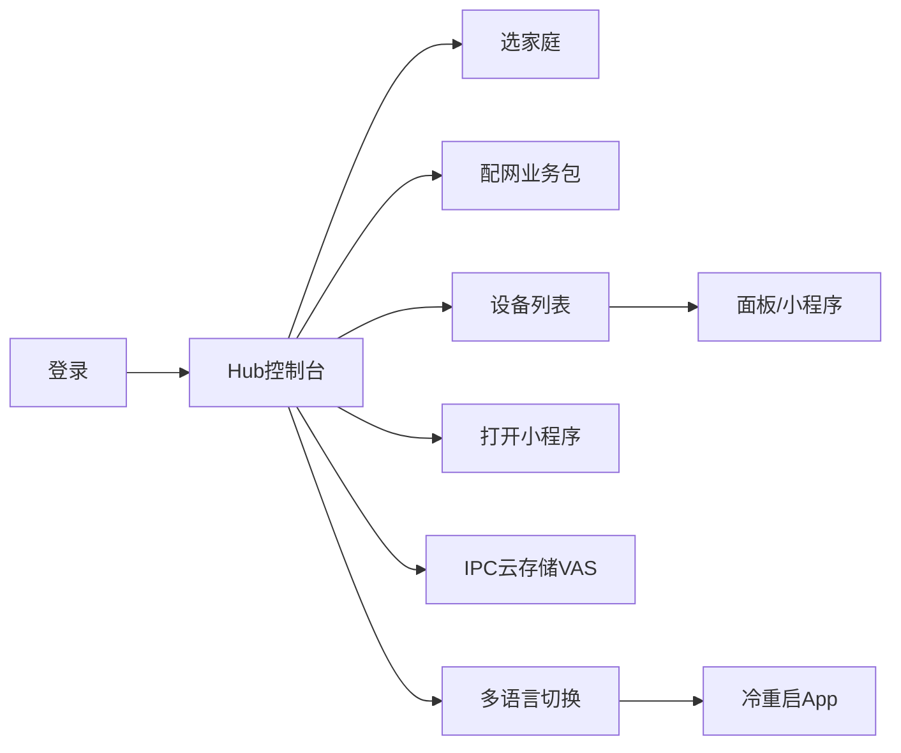

# MiniPanel Demo · 操作文档

> 与当前仓库代码同步。集成细节见：[MiniPanelDemo_SDK_集成文档.md](./MiniPanelDemo_SDK_集成文档.md)  
> 仓库：https://github.com/liuhepan-web/MiniPanelDemo2  
> 官方参考：[应用内多语言切换](https://github.com/tuya/tuya-ui-bizbundle-android-demo/blob/feature/setLanguage/docs/%E5%BA%94%E7%94%A8%E5%86%85%E5%A4%9A%E8%AF%AD%E8%A8%80%E5%88%87%E6%8D%A2.md) · [IPC 增值服务 2.0](https://developer.tuya.com/cn/docs/app-development/ipc-value-added-service-2?id=Ke2iaqr2xoyz5)

---

## 1. 运行前准备

1. Android Studio 打开工程根目录 `MiniPanelDemo2`。
2. `app/libs/` 放入平台下发的 **安全算法包** AAR（若平台要求）。
3. IoT 平台 App 包名设为 `com.example.hallmond`，并绑定当前调试证书 **SHA256**。
4. 配置 `local.properties`（勿提交）：

```bash
cp local.properties.example local.properties
```

```properties
sdk.dir=/path/to/Android/sdk
appKey=你的_AppKey
appSecret=你的_AppSecret
```

5. 真机调试（ABI：`armeabi-v7a` / `arm64-v8a`）；模拟器无法完整验证配网 / 蓝牙 / 小程序。
6. 运行 Debug，启动页为 **登录**；应用名显示为 **小程序Demo**。

> 真我 / OPPO 等机型用文件管理器安装可能提示「高风险」。推荐：`./gradlew :app:installDebug` 或 Android Studio Run。

---

## 2. 整体流程

```text
登录 / 注册
  → Hub 控制台
      ├─ 用户信息
      ├─ 选择家庭 / 家庭设置
      ├─ 设备配网（BizBundle）
      ├─ 设备列表 → 打开面板
      ├─ 打开小程序 / 清缓存 / vConsole
      ├─ IPC 云存储 VAS（小程序页）
      ├─ 应用内多语言切换（切换后重启）
      └─ 退出登录
```



---

## 3. 界面总览

### 3.1 登录页

类：`DemoLoginActivity`

| 步骤 | 操作 |
|------|------|
| 登录 | 国家码 + 账号 + 密码 → 登录 |
| 注册 | 进入 `UserRegisterActivity` 完成注册 |
| 成功 | 进入 Hub |

---

### 3.2 Hub 控制台 ★

布局：`hub.xml` · 类：`DemoHubActivity`

```text
┌─────────────────────────────────────┐
│ 小程序Demo · Hub                     │
├─────────────────────────────────────┤
│ [1. 用户信息]                        │
│ [2. 选择家庭]                        │
│ [3. 家庭设置]                        │
│ [4. 设备配网（业务包）]               │
│ [5. 设备列表]                        │
│ [6. 打开小程序]                      │
│ [7. 清除小程序缓存]                  │
│ [8. IPC cloud storage VAS]          │
│ [9. Language / 语言]                │
│  vConsole          [开关]            │
│ [退出登录]                           │
└─────────────────────────────────────┘
```

| 按钮 | 作用 | 前置条件 |
|------|------|----------|
| 用户信息 | 展示当前登录用户 | 已登录 |
| 选择家庭 | 选当前 `homeId` 并 `shiftCurrentFamily` | 已登录 |
| 家庭设置 | 路由打开家庭设置业务包 | 已选家庭 |
| 设备配网 | `ThingDeviceActivatorManager.startDeviceActiveAction` | **已选家庭** |
| 设备列表 | 当前家庭设备，点开面板 | 已选家庭 |
| 打开小程序 | 按 appId 打开小程序 | 已登录；建议已选家庭 |
| 清除小程序缓存 | 清理 MiniApp 缓存 | — |
| IPC 云存储 VAS | 拉取云存储页 URL 并 `miniApp` 打开 | **已选家庭** |
| Language / 语言 | English / 简体中文 / 跟随系统；**切换后冷重启** | — |
| vConsole | 开关小程序调试面板 | — |
| 退出登录 | 清家庭缓存 → 回登录页 | — |

---

### 3.3 选择家庭

类：`DemoHomePickerActivity`

1. 进入后拉取家庭列表。  
2. 点选一条 → 写入 `DemoCurrentHomeStore`。  
3. Hub `onResume` / 返回后会 `getHomeDetail` + `shiftCurrentFamily`。

**注意**：配网、云存储 VAS、多数面板都必须有有效 `homeId`，禁止传 `-1`。

---

### 3.4 设备配网（业务包）

入口：Hub → **设备配网**。

1. 进入「添加设备」搜索页。  
2. 若弹出「访问蓝牙权限」引导：点 **继续** → 在系统弹窗中允许。  
3. Android 12+ 需授予：附近的设备（蓝牙）+ 建议打开位置服务。  
4. 配网成功后 Demo 会尝试打开设备面板。

权限说明见集成文档 §7。

---

### 3.5 设备列表 / 面板

类：`DemoDeviceListActivity`

| 操作 | 说明 |
|------|------|
| 点击设备 | 经 `AbsPanelCallerService` 打开面板（RN / 小程序等按产品类型） |

---

### 3.6 打开小程序

Hub → **打开小程序**：按代码中配置的 `appId` 调用

`ThingMiniAppClient.coreClient().openMiniAppByAppId(...)`。

建议先打开 **vConsole** 便于排查白屏 / 接口错误。

---

### 3.7 IPC 云存储 VAS

类：`DemoIpcCloudVasActivity`

1. 先登录并选择家庭。  
2. Hub → **IPC cloud storage VAS**。  
3. 点 **Open cloud storage miniapp**。  
4. Demo 使用固定设备 ID（见页面文案），`spaceId` = 当前 `homeId`。  
5. `fetchValueAddedServiceUrl` 成功后 `UrlRouter` → `miniApp`。

官方文档：[增值服务 2.0](https://developer.tuya.com/cn/docs/app-development/ipc-value-added-service-2?id=Ke2iaqr2xoyz5)

---

### 3.8 应用内多语言切换 ★

入口：Hub → **Language / 语言**。

| 选项 | 含义 |
|------|------|
| English | `en` |
| 简体中文 | `zh` |
| 跟随系统 | 清空 App Locale，跟随系统 |

**操作结果**：

1. 调用 `AppCompatDelegate.setApplicationLocales`。  
2. Demo **主动冷重启** App（清栈 + `Runtime.exit`），保证业务包 / 小程序重新拉取语言。  
3. 冷启动后仍保持所选语言（AppCompat / 系统持久化）。

验证建议：

- [ ] 切中文 → 重启后 Hub / 配网 / 家庭设置文案为中文  
- [ ] 切英文 → 业务包页面跟随英文  
- [ ] 跟随系统 → 与系统语言一致  

官方方案说明：[应用内多语言切换](https://github.com/tuya/tuya-ui-bizbundle-android-demo/blob/feature/setLanguage/docs/%E5%BA%94%E7%94%A8%E5%86%85%E5%A4%9A%E8%AF%AD%E8%A8%80%E5%88%87%E6%8D%A2.md)

---

## 4. 验收清单

- [ ] 登录 / 注册成功  
- [ ] 选择家庭后 Hub 功能可用  
- [ ] 配网页可进入；蓝牙权限引导可点「继续」并授权  
- [ ] 设备列表能打开面板  
- [ ] 小程序能打开；vConsole 可开关  
- [ ] IPC 云存储 VAS 能拉到 URL 并打开小程序页（设备需支持云存储）  
- [ ] 多语言切换后 App 重启，业务包文案跟随  

---

## 5. 常见问题（操作侧）

| 现象 | 处理 |
|------|------|
| 配网提示「访问蓝牙权限」 | 点继续授权；系统设置打开「附近的设备」+ 位置；确认 Manifest 含 `BLUETOOTH_SCAN/CONNECT/ADVERTISE` |
| 提示需要家庭 | 先点「选择家庭」 |
| 小程序白屏 | 确认已 `ThingMiniAppClient.initialize`；开 vConsole；检查 homekit / basekit |
| 真我安装「高风险」 | 用 adb / `installDebug`，勿依赖文件管理器安装 |
| 云存储打不开 | 确认设备支持云存储、homeId 有效、MiniApp 已初始化 |
| 切换语言后部分页仍旧语言 | Demo 会冷重启；自研实现务必重启并走 `setApplicationLocales` |
